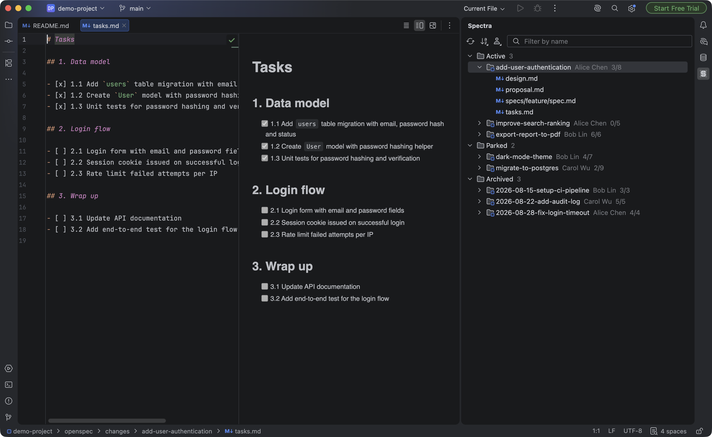
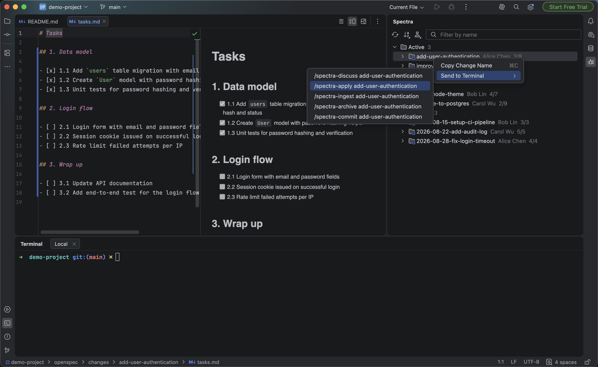
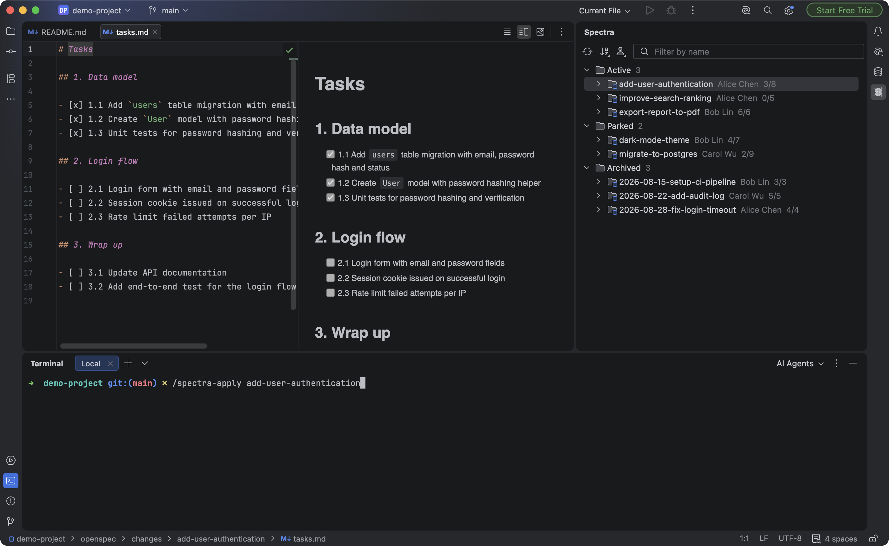
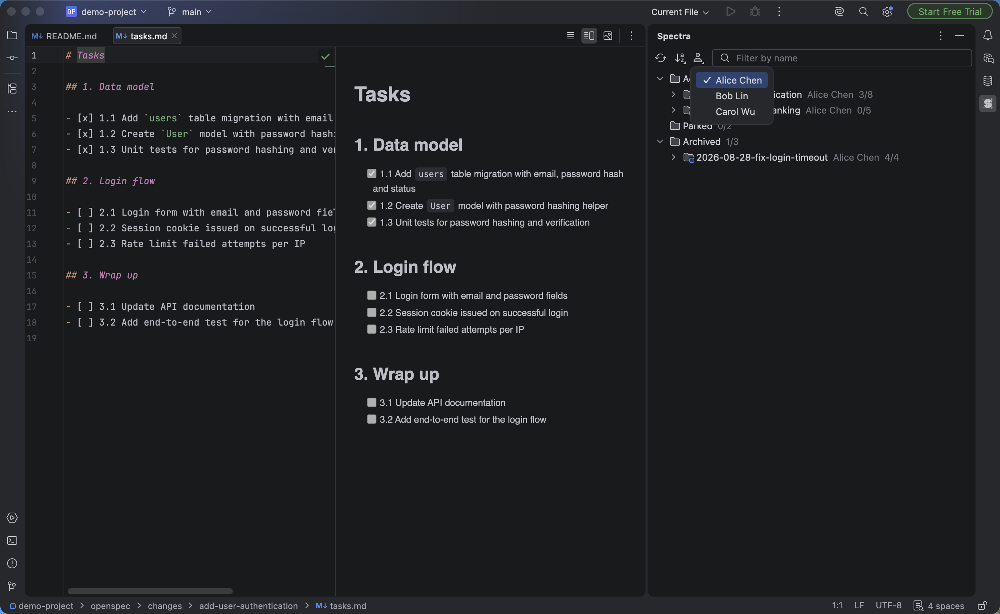
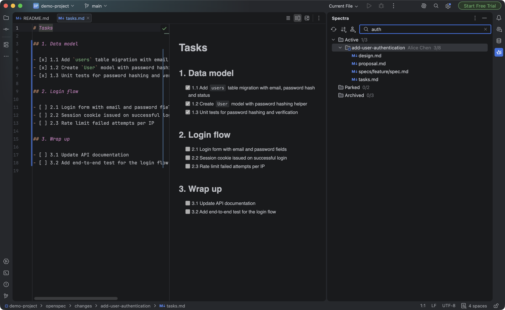

# Spectra Viewer

*English · [繁體中文](README.zh-TW.md)*

[](https://github.com/fripig/idea-spectra-viewer/actions/workflows/build.yml)
[](https://plugins.jetbrains.com/plugin/33519)
[](https://plugins.jetbrains.com/plugin/33519)
[](LICENSE)

Browse your [Spectra](https://spectra.5xcamp.us/) changes right inside your JetBrains IDE — no app switching.

Spectra moves parked changes out of `openspec/changes/` into the git directory, which makes them invisible in the project tree. This plugin adds a **Spectra** tool window that lists Active, Parked, and Archived changes side by side, shows the task progress of each, opens their Markdown documents directly in the editor, and hands the matching Spectra command straight to your terminal.

The plugin reads files directly. It **does not require the Spectra app to be running**, and it never touches Spectra's internal database.



> **Unofficial project**: This is a community-built third-party plugin. It is not affiliated with, nor endorsed by, Spectra. All Spectra-related names belong to their respective owners.

## Features

- **Three groups side by side**: Active (`openspec/changes/`), Parked (`spectra-app/changes/` under the git directory), and Archived (`openspec/changes/archive/`). Group nodes show the change count; while filtering, they show both the matching count and the total.
- **Task progress**: Parses each change's `tasks.md` and shows "completed／total" on the node. Checkboxes inside code blocks are ignored.
- **Proposer**: Reads `created_by` from each change's `.openspec.yaml` and shows the proposer between the change name and the task progress, in all three groups. Only the name is shown — the email address is dropped. A change whose metadata carries no usable name shows no proposer and no placeholder.
- **Open documents**: Double-click an artifact node to open its Markdown in the editor. If the file has been deleted, you get a non-blocking notification instead of an error.
- **Copy change names**: Select one or more change nodes and press the IDE's Copy shortcut, or right-click and choose **Copy Change Name**. You get the name alone — no group prefix, no progress counts — and one name per line when several are selected. Group and artifact nodes are not copyable, so the action stays disabled unless the selection holds at least one change.
- **Send a command to your terminal**: Right-click a change and choose **Send to Terminal** to put `/spectra-discuss`, `/spectra-apply`, `/spectra-ingest`, `/spectra-archive`, or `/spectra-commit` — already carrying that change's name — at the prompt of the terminal tab you currently have selected. The command is typed for you but never run: you press Enter yourself, so picking the wrong tab costs nothing more than a line you can delete. With the Terminal tool window closed or holding no tab, the same menu reads **Copy Command** and writes that line to the clipboard instead; the title always states which of the two it is about to do. Available when exactly one change is selected.
- **Sorting**: Sort by Name, Modified, or Created — Modified (newest first) is the default. Entries with an unknown date always sort last.
- **Name filter**: Type to filter change names in real time (case-insensitive), applied to all three groups at once. All artifacts of a matching change are kept.
- **Refresh**: Re-scanning from the toolbar preserves the expanded state and the filter text.
- **Git worktree support**: When `.git` is a file, the real git directory is resolved via `gitdir:` and `commondir`, and parked changes are located from there.

Sorting and filtering only rebuild the tree — they never re-scan the file system. Scanning itself always runs on a background thread and never blocks the EDT.

## Screenshots

**Send a command to your terminal**



**The command lands at the prompt, ready for you to press Enter**



**Filter by author**



**Filter by name, combined with the author filter**



The screenshots are re-taken with the tooling described in [tools/README.md](tools/README.md).

## Installation

In your IDE choose **Settings → Plugins → Marketplace**, search for **Spectra Viewer**, and install it — or install it straight from [JetBrains Marketplace](https://plugins.jetbrains.com/plugin/33519).

Alternatively, download the `.zip` from [Releases](https://github.com/fripig/idea-spectra-viewer/releases), then in your IDE choose **Settings → Plugins → ⚙ → Install Plugin from Disk...** and restart.

Requirements: JetBrains IDE 2026.2 (build 262) or later. The only hard dependency is `com.intellij.modules.platform`, so the plugin installs on any JetBrains IDE — PhpStorm, IntelliJ IDEA, and the rest. Sending a command additionally uses the bundled Terminal plugin, as an optional dependency: with that plugin disabled everything else still works and the command submenu simply copies instead of sending.

## Development

```bash
./gradlew build          # compile and run unit tests
./gradlew buildPlugin    # produce build/distributions/*.zip
./gradlew verifyPlugin   # binary compatibility check — CI runs this too
./gradlew runIde         # try it out in a sandbox IDE
```

The compilation target is JVM 21, but since the build compiles against IntelliJ Platform 2026.2 artifacts, it requires a newer JDK to run (CI uses JDK 25).

`verifyPlugin` is worth running before a release: a call into an internal platform API compiles and runs perfectly well locally, and is rejected by the Marketplace. It downloads the Plugin Verifier CLI on first use.

Release process: push a `release-<version>` tag, and GitHub Actions derives `PLUGIN_VERSION` from the tag, builds, tests, uploads the plugin to JetBrains Marketplace, and publishes the GitHub Release. To retry a Marketplace upload without cutting a new tag, run the workflow manually with the **publish** input checked — it uploads the version committed in `gradle.properties`.

## Project structure

```
src/main/kotlin/com/github/fripig/spectraviewer/
├── discovery/   # file system scanning, parsing tasks.md and .openspec.yaml
├── model/       # SpectraChange, sorting rules
├── terminal/    # the only place that touches the Terminal plugin
└── toolwindow/  # tool window UI and tree nodes
openspec/specs/  # Spectra specs (this project is itself developed with SDD)
```

## Contributors

Thanks to everyone who has contributed:

[](https://github.com/fripig/idea-spectra-viewer/graphs/contributors)

## License

[MIT](LICENSE) © fripig and contributors
